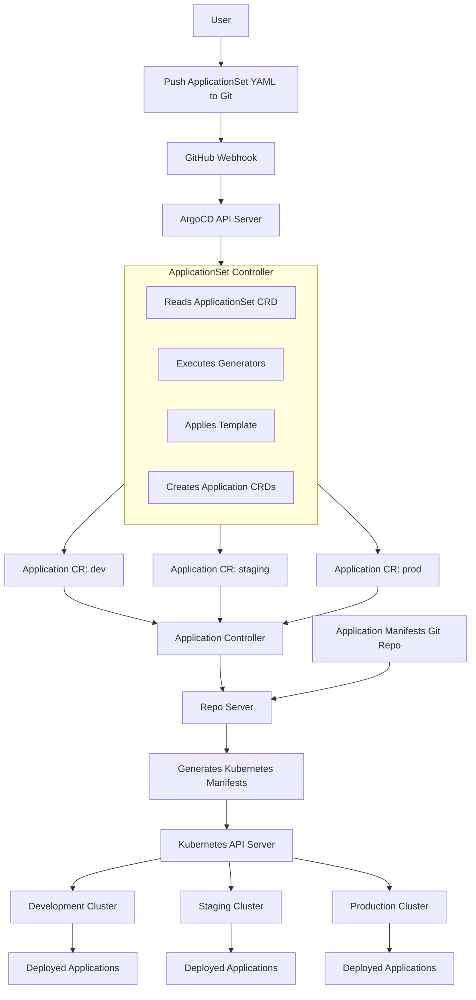

```mermaid

flowchart TD
    A[User] --> B[Push ApplicationSet YAML to Git]
    B --> C[GitHub Webhook]
    C --> D[ArgoCD API Server]
    
    D --> E[ApplicationSet Controller]
    
    subgraph E[ApplicationSet Controller]
        E1[Reads ApplicationSet CRD]
        E2[Executes Generators]
        E3[Applies Template]
        E4[Creates Application CRDs]
    end
    
    E --> F[Application CR: dev]
    E --> G[Application CR: staging]
    E --> H[Application CR: prod]
    
    F --> I[Application Controller]
    G --> I
    H --> I
    
    I --> J[Repo Server]
    K[Application Manifests Git Repo] --> J
    J --> L[Generates Kubernetes Manifests]
    L --> M[Kubernetes API Server]
    
    M --> N[Development Cluster]
    M --> O[Staging Cluster]
    M --> P[Production Cluster]
    
    N --> Q[Deployed Applications]
    O --> R[Deployed Applications]
    P --> S[Deployed Applications]

```
