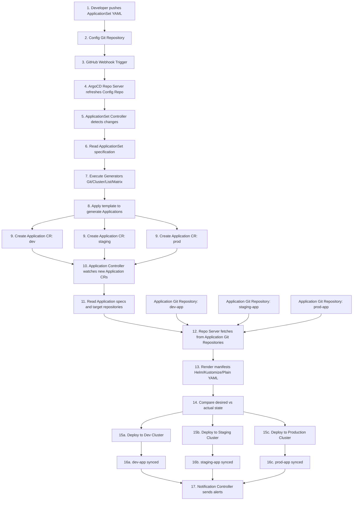

```mermaid

flowchart TD
    %% Step 1: Developer pushes ApplicationSet
    A[1. Developer pushes ApplicationSet YAML] --> B[2. Config Git Repository]
    
    %% Step 2-3: Webhook and repo refresh
    B --> C[3. GitHub Webhook Trigger]
    C --> D[4. ArgoCD Repo Server refreshes Config Repo]
    
    %% Step 4-8: ApplicationSet Controller Process
    D --> E[5. ApplicationSet Controller detects changes]
    E --> F[6. Read ApplicationSet specification]
    F --> G[7. Execute Generators Git/Cluster/List/Matrix]
    G --> H[8. Apply template to generate Applications]
    
    %% Step 9: Generate individual Applications
    H --> I[9. Create Application CR: dev]
    H --> J[9. Create Application CR: staging]
    H --> K[9. Create Application CR: prod]
    
    %% Step 10: Application Controller takes over
    I --> L[10. Application Controller watches new Application CRs]
    J --> L
    K --> L
    
    %% Step 11-12: Application processing
    L --> M[11. Read Application specs and target repositories]
    M --> N[12. Repo Server fetches from Application Git Repositories]
    
    %% Application repositories (separate from config repo)
    O[Application Git Repository: dev-app] --> N
    P[Application Git Repository: staging-app] --> N
    Q[Application Git Repository: prod-app] --> N
    
    %% Step 13-14: Manifest processing and deployment
    N --> R[13. Render manifests Helm/Kustomize/Plain YAML]
    R --> S[14. Compare desired vs actual state]
    
    %% Step 15: Deploy to clusters
    S --> T[15a. Deploy to Dev Cluster]
    S --> U[15b. Deploy to Staging Cluster]
    S --> V[15c. Deploy to Production Cluster]
    
    %% Step 16: Sync status
    T --> W[16a. dev-app synced]
    U --> X[16b. staging-app synced]
    V --> Y[16c. prod-app synced]
    
    %% Step 17: Notifications
    W --> Z[17. Notification Controller sends alerts]
    X --> Z
    Y --> Z

```
