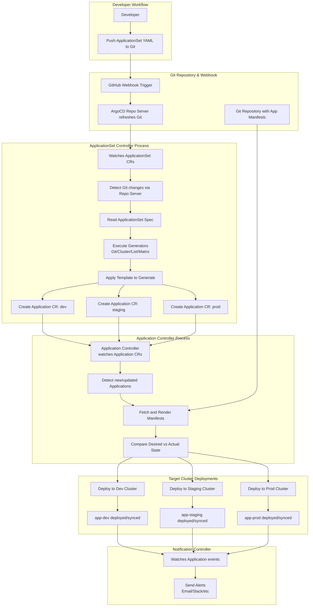

```mermaid

flowchart TD
    %% Developer section
    subgraph DEV [Developer Workflow]
        A[Developer] --> B[Push ApplicationSet YAML to Git]
    end
    
    %% Git/Webhook section  
    subgraph GIT [Git Repository & Webhook]
        B --> C[GitHub Webhook Trigger]
        C --> D[ArgoCD Repo Server refreshes Git]
        Q[Git Repository with App Manifests]
    end
    
    %% ApplicationSet Controller section
    subgraph ASC [ApplicationSet Controller Process]
        D --> E[Watches ApplicationSet CRs]
        E --> F[Detect Git changes via Repo Server]
        F --> G[Read ApplicationSet Spec]
        G --> H[Execute Generators<br/>Git/Cluster/List/Matrix]
        H --> I[Apply Template to Generate]
        
        %% Generated Applications directly in the flow
        I --> K[Create Application CR: dev]
        I --> L[Create Application CR: staging] 
        I --> M[Create Application CR: prod]
    end
    
    %% Application Controller section
    subgraph AC [Application Controller Process]
        K --> N[Application Controller<br/>watches Application CRs]
        L --> N
        M --> N
        N --> O[Detect new/updated Applications]
        O --> P[Fetch and Render Manifests]
        Q --> P
        P --> R[Compare Desired vs Actual State]
    end
    
    %% Cluster deployment section
    subgraph CLUSTERS [Target Cluster Deployments]
        R --> S[Deploy to Dev Cluster]
        R --> T[Deploy to Staging Cluster] 
        R --> U[Deploy to Prod Cluster]
        
        S --> V[app-dev deployed/synced]
        T --> W[app-staging deployed/synced]
        U --> X[app-prod deployed/synced]
    end
    
    %% Notification Controller section
    subgraph NOTIF [Notification Controller]
        V --> Y[Watches Application events]
        W --> Y
        X --> Y
        Y --> Z[Send Alerts<br/>Email/Slack/etc]
    end

```
