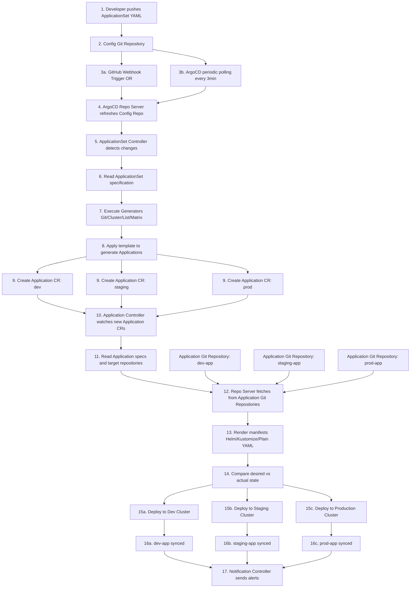

```mermaid
flowchart TD
    %% Step 1: Developer pushes ApplicationSet
    A[1. Developer pushes ApplicationSet YAML] --> B[2. Config Git Repository]
    
    %% Step 2-3: Detection methods (webhook OR polling)
    B --> C[3a. GitHub Webhook Trigger OR]
    B --> D[3b. ArgoCD periodic polling every 3min]
    C --> E[4. ArgoCD Repo Server refreshes Config Repo]
    D --> E
    
    %% Step 4-8: ApplicationSet Controller Process
    E --> F[5. ApplicationSet Controller detects changes]
    F --> G[6. Read ApplicationSet specification]
    G --> H[7. Execute Generators Git/Cluster/List/Matrix]
    H --> I[8. Apply template to generate Applications]
    
    %% Step 9: Generate individual Applications
    I --> J[9. Create Application CR: dev]
    I --> K[9. Create Application CR: staging]
    I --> L[9. Create Application CR: prod]
    
    %% Step 10: Application Controller takes over
    J --> M[10. Application Controller watches new Application CRs]
    K --> M
    L --> M
    
    %% Step 11-12: Application processing
    M --> N[11. Read Application specs and target repositories]
    N --> O[12. Repo Server fetches from Application Git Repositories]
    
    %% Application repositories (separate from config repo)
    P[Application Git Repository: dev-app] --> O
    Q[Application Git Repository: staging-app] --> O
    R[Application Git Repository: prod-app] --> O
    
    %% Step 13-14: Manifest processing and deployment
    O --> S[13. Render manifests Helm/Kustomize/Plain YAML]
    S --> T[14. Compare desired vs actual state]
    
    %% Step 15: Deploy to clusters
    T --> U[15a. Deploy to Dev Cluster]
    T --> V[15b. Deploy to Staging Cluster]
    T --> W[15c. Deploy to Production Cluster]
    
    %% Step 16: Sync status
    U --> X[16a. dev-app synced]
    V --> Y[16b. staging-app synced]
    W --> Z[16c. prod-app synced]
    
    %% Step 17: Notifications
    X --> AA[17. Notification Controller sends alerts]
    Y --> AA
    Z --> AA
```
